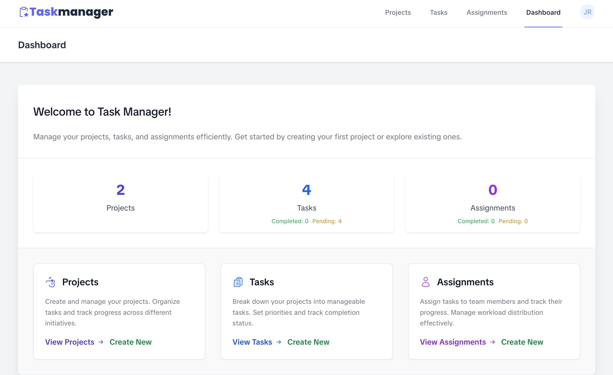
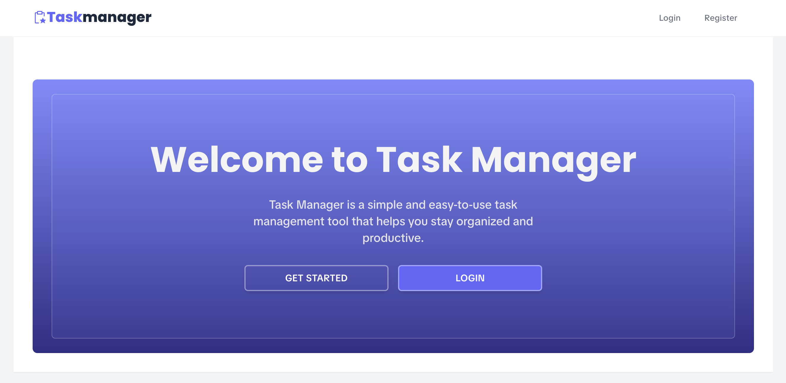
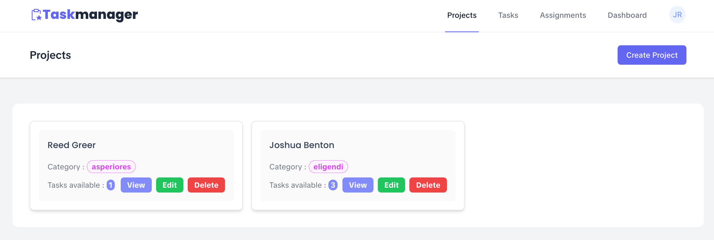
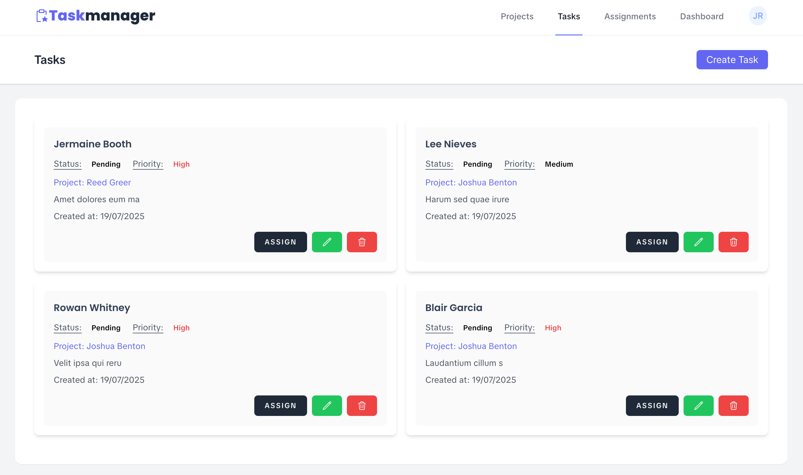
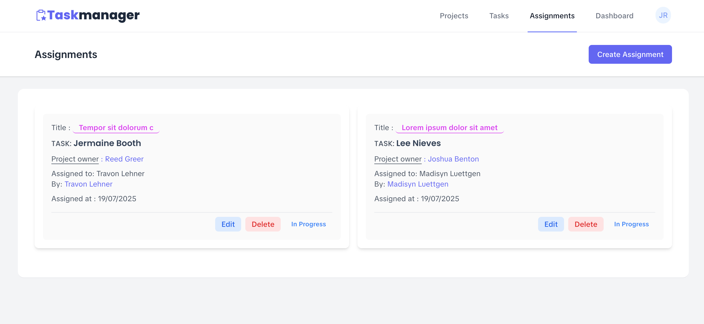

# Task Manager

Task Manager is a simple and intuitive web application designed to help individuals and teams organize, track, and manage their projects, tasks, and assignments efficiently. Built with Laravel, it provides a modern, user-friendly interface and robust features for productivity and collaboration.

## Overview

Task Manager enables you to:
- Create and manage multiple projects
- Break down projects into tasks with priorities and statuses
- Assign tasks to team members and track their progress
- Visualize your workflow and stay organized with a clean dashboard

  
  

## Core Functionalities

- **Project Management**: Create, edit, and organize projects. Each project can have its own category, status (Pending, In Progress, Completed, Cancelled), and description.
   
- **Task Management**: Add tasks to projects, set their priority (Low, Medium, High), and track their status (Pending, In Progress, Completed, Cancelled).
   
- **Assignments**: Assign tasks to users, set deadlines, and monitor progress. Assignments help distribute workload and ensure accountability.
   
- **Dashboard**: Get an overview of your projects, tasks, and assignments. Visual stats help you track progress and pending work at a glance.
   
- **User Management**: Register, log in, and manage your profile. Secure authentication with support for password reset and two-factor authentication.
- **Responsive Design**: Enjoy a seamless experience on both desktop and mobile devices.

## Getting Started

1. **Clone the repository**
2. **Install dependencies**: `composer install && npm install`
3. **Set up your environment**: Copy `.env.example` to `.env` and configure your database
4. **Run migrations and seeders**: `php artisan migrate --seed`
5. **Start the development server**: `php artisan serve`

## License

This project is open-sourced under the [MIT license](https://opensource.org/licenses/MIT).
